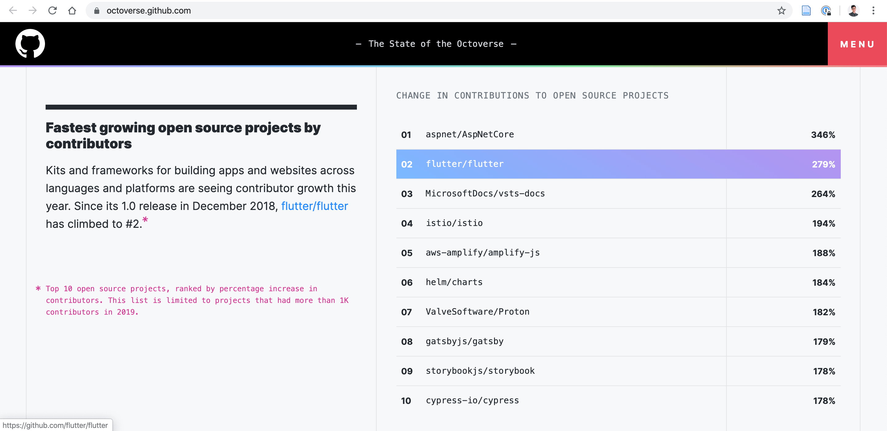

สวัสดีครับจาก Flutter ความร้อนแรงมากในช่วงนี้ เลยขอเกาะกระแสกันซักหน่อย ได้ถือโอกาสรื้อเว็บใหม่ (ย้ายบ้านแต่ใช้ domain เดิม)

จะเข้าใกล้ปี 2020 แล้ว เรามาดูข้อมูลสถิตกันบ้างว่า Flutter เอง community โตแค่ไหน จาก [รายงานของ Github](https://octoverse.github.com/) ปี 2018-2019 พบว่า ทั้ง Flutter และภาษา Dart เอง Github community เองมีการใช้งานเพิ่มขึ้นอย่างก้าวกระโดด

จากข้อมูลเกี่ยวกับรายงานสามารถได้ดังนี้

- มีจำนวน Contributors ที่พัฒนาโปรเจ็ค Open source ประมาณ 13,000 คน (ซึ่งเป็นอันดับที่ 3)
- มีจำนวน Contributors ที่พัฒนาโปรเจ็ค Open source เพิ่มขึ้น 279% (ซึ่งเป็นอันดับที่ 2)
- และ ภาษา Dart ก็มีคนใช้งานมากถึงขึ้น 532% 

## แล้วอะไรทำให้ Flutter ถึงน่าสนใจ

จริงๆ ต้องยกให้ภาษา Dart ที่มีความหยืดหยุ่นค่อนข้างสูง เหมือน Flutter ดีได้ด้วยความสามารถของภาษา Dart เอาไว้ผมจะพูดในหัวข้อถัดๆ ไป

# สารบัญ 

## ภาค 1 เริ่ม Flutter จากศูนย์
- Flutter 01: ปฐมบทแห่งการเขียนโปรแกรมบนมือถือ Cross-Platform
- Flutter 02: แนะนำภาษา Dart ที่ทรงพลังและยืดหยุ่น เหมือนเกิดมาเพื่อ Flutter
- Flutter 03: เริ่มต้นครั้งแรกกับ Flutter
- Flutter 04: ทุกสิ่งอย่างคือ Widget 
- Flutter 05: การออกแบบ Layout บน Flutter ด้วย Row & Col
- Flutter 07: ว่าด้วยเรื่องของ "ช่องว่าง" ด้วย Padding
- Flutter 08: สร้าง List จาก Data
- Flutter 09: Conditional Rendering
- Flutter 10: Handling User Input
- Flutter 11: Conditional Rendering in List
- Flutter 12: Manage Option State (3 button-group)
- Flutter 13: List & (3 button-group)

## ภาค 2: เรียนรู้การจัดการ State ของ Flutter ผ่าน Todo App
- Flutter 14: ว่าด้วยเรื่องของการจัดการ State
- Flutter 15: Todo App 01 เขียนทุกอย่างยัดลงใน 1 Widget
- Flutter 16: Todo App 02 ออกแบบใหม่โดยใช้หลาย Widgets
- Flutter 17: Todo App 03 ใช้ root widgets เป็นที่เก็บ State แล้วส่ง function ไปยัง Widgets ลูกเพื่อจัดการ parents state
- Flutter 18: Todo App 04 (Manually Dependency Injection)
- Flutter 19: Counter App, bloc_01_counter (Implement BLOC by RxDart in Counter App)
- Flutter 20: Counter App, provider_01_counter (Provider as Dependency Injection in Counter App) & provider_consumer_02_counter
- Flutter 21: Todo App 05 todo_05_provider (Dependency Injection)
- Flutter 22: Todo 06 provider architecture + todo 07 provider router
- Flutter 23: Todo 07 provider_architecture_firebase

# บทเสริม
- Flutter Appendix 01: Debug Flutter UI
- Flutter Appendix 02: AlertDialog
- Flutter Appendix 03: GestureDectector
- Flutter Appendix 04: Checkbox
- Flutter Appendix 05: Expanded
- Flutter Appendix 06: AppBar
- การย้ายโปรเจ็ค Flutter ข้ามเครื่อง
- การรัน Flutter บนเว็บ