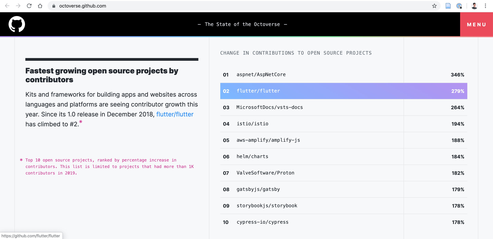

สวัสดีครับจาก Flutter ความร้อนแรงมากในช่วงนี้ เลยขอเกาะกระแสกันซักหน่อย ได้ถือโอกาสรื้อเว็บใหม่ (ย้ายบ้านแต่ใช้ domain เดิม)

จะเข้าใกล้ปี 2020 แล้ว เรามาดูข้อมูลสถิตกันบ้างว่า Flutter เอง community โตแค่ไหน จาก [รายงานของ Github](https://octoverse.github.com/) ปี 2018-2019 พบว่า ทั้ง Flutter และภาษา Dart เอง Github community เองมีการใช้งานเพิ่มขึ้นอย่างก้าวกระโดด

จากข้อมูลเกี่ยวกับรายงานสามารถได้ดังนี้

- มีจำนวน Contributors ที่พัฒนาโปรเจ็ค Open source ประมาณ 13,000 คน (ซึ่งเป็นอันดับที่ 3)
- มีจำนวน Contributors ที่พัฒนาโปรเจ็ค Open source เพิ่มขึ้น 279% (ซึ่งเป็นอันดับที่ 2)
- และ ภาษา Dart ก็มีคนใช้งานมากถึงขึ้น 532% 

## แล้วอะไรทำให้ Flutter ถึงน่าสนใจ

จริงๆ ต้องยกให้ภาษา Dart ที่มีความหยืดหยุ่นค่อนข้างสูง เอาไว้ผมจะพูดในหัวข้อถัดๆ ไป

# สารบัญ 
- Flutter 01: ปฐมบทแห่งการเขียนโปรแกรมบนมือถือ Cross-Platform
- Flutter 02: แนะนำภาษา Dart ที่ทรงพลังและยืดหยุ่น เหมือนเกิดมาเพื่อ Flutter
- Flutter 03: เริ่มต้นกับ Flutter
- Flutter 04: Flutter UI
- Flutter 06: Conditional Rendering
- Flutter 06: Conditional List

test `src/test.json` go to 

